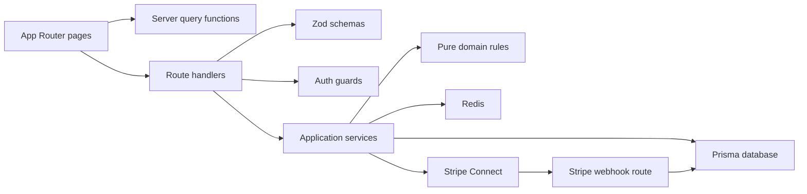

# 01 System Map

## Shape

This is a single-app repository, not a monorepo. `README.md:18-26` identifies the main directories: `app/`, `src/components/`, `src/domain/`, `src/server/`, `prisma/`, `tests/`, and `docs/`.

```text
buildecom/
  app/                 Next.js pages and route handlers
  src/components/      UI components
  src/domain/          Pure business rules
  src/server/          Server adapters and services
  prisma/              Data schema and seed
  tests/               Unit, integration, E2E targets
  docs/                Architecture docs, prototype, upskill lab
```

## Runtime Surface Map

| Surface | Owned By | Public Interface | Private Internals |
| --- | --- | --- | --- |
| Buyer UI | `app/(marketplace)/page.tsx:8-47` | `/`, `/products/[slug]` | `src/components/marketplace/*`, `src/server/catalog/queries.ts` |
| Seller UI | `app/(seller)/seller/dashboard/page.tsx:6-71` | `/seller/dashboard` | `src/server/sellers/queries.ts:6-46` |
| Admin UI | `app/(admin)/admin/disputes/page.tsx:6-63` | `/admin/disputes` | `src/server/sellers/queries.ts:48-87` |
| API | `app/api/v1/**/route.ts` | JSON route handlers | validation, auth guards, services |
| Persistence | `prisma/schema.prisma:63-366` | Prisma models | query services and transactions |
| Payments | `src/server/payments/stripe-connect.ts:23-77` | Stripe Connect adapter | no direct UI dependency |
| Security | `src/server/auth/session.ts:30-128`, `middleware.ts:3-18` | cookies, tokens, headers | Redis, JWT, role helpers |
| Tests | `tests/unit/*.test.ts`, `tests/e2e/*.spec.ts` | Vitest, Playwright scripts | mocks and future fixtures |

## Ownership Diagram



## Public Interfaces

- UI routes: `app/(marketplace)/page.tsx:8-47`, `app/(marketplace)/products/[slug]/page.tsx:7-54`, `app/(seller)/seller/dashboard/page.tsx:6-71`, `app/(admin)/admin/disputes/page.tsx:6-63`.
- API routes: `app/api/v1/checkout/sessions/route.ts:10-22`, `app/api/v1/cart/items/route.ts:10-85`, `app/api/v1/orders/[orderId]/status/route.ts:9-22`, `app/api/webhooks/stripe/route.ts:7-60`.
- Database contract: `prisma/schema.prisma:63-366`.
- Test contract: `package.json:10-14`.

## Private Internals

- Domain helpers are not API contracts by themselves: `src/domain/checkout/pricing.ts:30-84`, `src/domain/orders/order-state.ts:1-28`.
- Infrastructure adapters should not leak into UI: `src/server/db/prisma.ts:1-16`, `src/server/cache/redis.ts:1-18`, `src/server/payments/stripe-connect.ts:6-77`.

## Senior Noticing

- The checkout service currently does transaction work before Stripe PaymentIntent creation: `src/server/checkout/service.ts:64-150`. That is a realistic place to discuss compensation and outbox patterns.
- Webhook processing stores events and marks them processed: `app/api/webhooks/stripe/route.ts:20-56`, but retries and partial transfer failure strategy should be investigated.
- Seller dashboard has hard-coded metrics for conversion: `src/server/sellers/queries.ts:39-44`. Treat as scaffolded, not production-complete.

## Drill

Draw this system from memory with five boxes: UI, API, domain, persistence, external services. Then annotate which file owns each boundary.

Self-grade:

- Basic: places files in the right boxes.
- Solid: explains which layer may import which.
- Strong: identifies one boundary leak or risk and suggests a test or migration.
